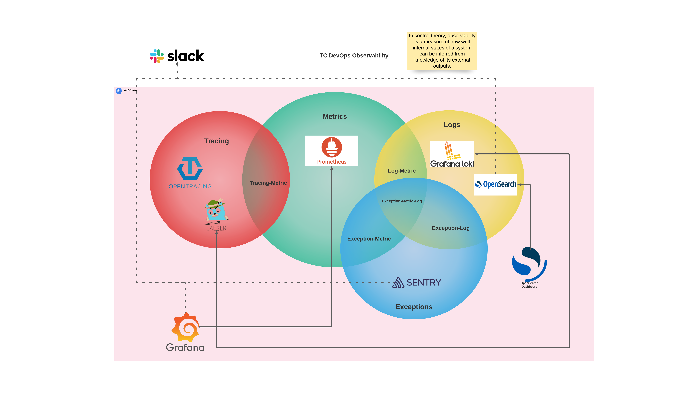

Hi!

## What is this project?

This project showcases the development of a Slack Bot using the Slack Bolt framework and FastAPI web framework, demonstrating the use of DevSpace for efficient deployment and orchestration within a Kubernetes cluster.

## Description

The Slack Bot is a solution designed to enhance team productivity and interaction within Slack channels. Developed with DevSpace, this bot is a prime example of modern, cloud-native technology in action. It's built on the versatile FastAPI web framework and utilizes a suite of powerful Kubernetes tools to ensure seamless deployment and operation.

## Kubernetes tools

There are several Kubernetes tools that are used by the Slack Bot deployment.

### Basic tools

These tools provide the basic functionality in the cluster and support other tools and applications.
They are deployed with Kubert basic package.

- `ExternalDNS` is a tool that automates the management of DNS records based on services and ingresses within your Kubernetes cluster. It simplifies the process of making Kubernetes services discoverable via public DNS servers. It supports a variety of DNS providers, including AWS Route53, Google Cloud DNS, Azure DNS, Cloudflare, and more, allowing flexibility in choosing where to host DNS records.  ExternalDNS synchronizes exposed Kubernetes Services and Ingresses with DNS providers. This means that it can automatically update DNS records as services are added, modified, or removed in the cluster. *<a href="https://artifacthub.io/packages/helm/bitnami/external-dns" target="_blank">Helm Chart</a>*.

- `Cert-Manager` is a native Kubernetes certificate management controller. It automates the management, issuance, and renewal of TLS certificates within Kubernetes environments. This tool plays a crucial role in ensuring secure communication within and to the Kubernetes cluster by providing a way to issue and manage SSL/TLS certificates easily. Cert-Manager automates the process of obtaining, renewing, and using SSL/TLS certificates for Kubernetes applications. It ensures that certificates are valid and up-to-date without manual intervention. Cert-Manager can automatically issue certificates from Let's Encrypt, a widely-used, free, automated, and open Certificate Authority (CA). It handles the ACME protocol (Automated Certificate Management Environment) for communicating with Let's Encrypt and other ACME-compliant CAs. *<a href="https://artifacthub.io/packages/helm/cert-manager/cert-manager" target="_blank">Helm Chart</a>*.

- `Ingress Nginx Controller` is a critical component for managing external access to HTTP and HTTPS services within a Kubernetes cluster. It provides an easy way to route traffic from outside the cluster to services within the cluster. Handles incoming SSL/TLS connections, offloading the encryption workload from the backend services. Allows routing to multiple hostnames configured on a single IP address. Routes traffic to different backend services based on the URL path. Commonly used to expose web applications running in Kubernetes to external users. *<a href="https://kubernetes.github.io/ingress-nginx/deploy/#quick-start" target="_blank">Helm Installation Instructions</a>*.

### Observability Tools

The image below represents a high-level overview of Kubert's observability stack.

While we deploy a full observability stack in our dev and production cluster, not every application uses the full stack. The Slack Bot has been configured for metrics and logs. It has been customized to allow Prometheus to scrap metrics from the FastAPI web container. Additionally, the logs have been customized in the Slack Bot application to allow for log collections and aggregation. The metrics and logs are used for both preventative and detective controls.

## Reading Guide

Since we cover a lot of concepts and tools in this documentation, we think that the order below will provide the most efficient review.

1. IDE [Here](vscode.html).
2. Python and library management [Here](python.html).
3. DevSpace [Here](devspace.html)
4. Slack configuration [Here](slack.html).
5. Before you dev [Here](start.html).
6. Application dev [Here](app_dev.html).
7. ETL [Here](etl.html).

### Slides From Webinar

- [Kubert App Journey](assets/pdf/kubert_application_journey.pdf)
- [Slack Bot](assets/pdf/slack_bot.pdf)
