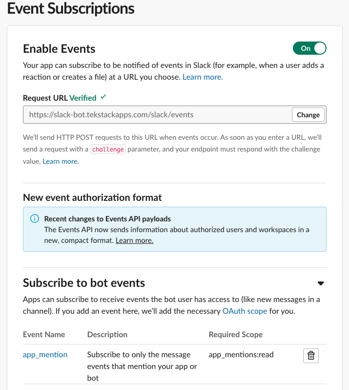

Since we are using Slack to build the bot, we have to configure Slack App. To initiate the Slack app creation follow this link <a href="https://api.slack.com/apps?new_app=1" target="_blank">create app</a>.

After any required login, you will be presented with:

Next, let's create the app "from scratch":

Choose the Slack app name and the Slack workspace where you will access the app during development.

## Basic Information

Once the app has been created in the "Basic Information" section you will find the "App Credentials". We use these credentials with the Slack Bot and define them in the`.env` file. More info [Here](start.md)

We can customize the look and feel of the Slack app in the "Display Information" section.

## OAuth and Permissions

Here, we configure the permissions for the Slack Bot. Under "Scopes" in the "Bot Token Scopes" add the required scopes.

For this application, we give the Bot "app_mentions:read" and "chat:write" permissions.

Once the scopes have been added the "Bot User OAuth Token" will be available in this section; it does require reinstalling the app. Reinstalling the app will simply refresh the app in the Slack workspace. The Bot Token should be added to the `.env` file.

## Slack Events

The configuration of Slack events has to be configured after the `.env` file has been updated, and the application has been deployed with DevSpace. [Here](app_dev.html)

In the "Events Subscriptions" we want to enable the events, configure the request URL, and configure the bot events subscriptions.

The URL is the public URL that is configured in the Ingress YAML. [Here](start.md)

## Slack Interactions

To allow for two-way communication, we enabled the Slack interactivity feature. Since we require the Slack Bot application to run for the request URL, the application must be deployed with DevSpace [Here](app_dev.html).

